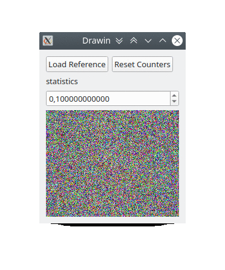

## Drawin

This is my first experimentation with evolutionaty computing.
This program generates random noises to an empty image.
The noise is accepted if it result in an aproximation to an image reference, or discarded otherwise.
As a consequence of this selection, the noises tend to copy the image reference without knowing it.

